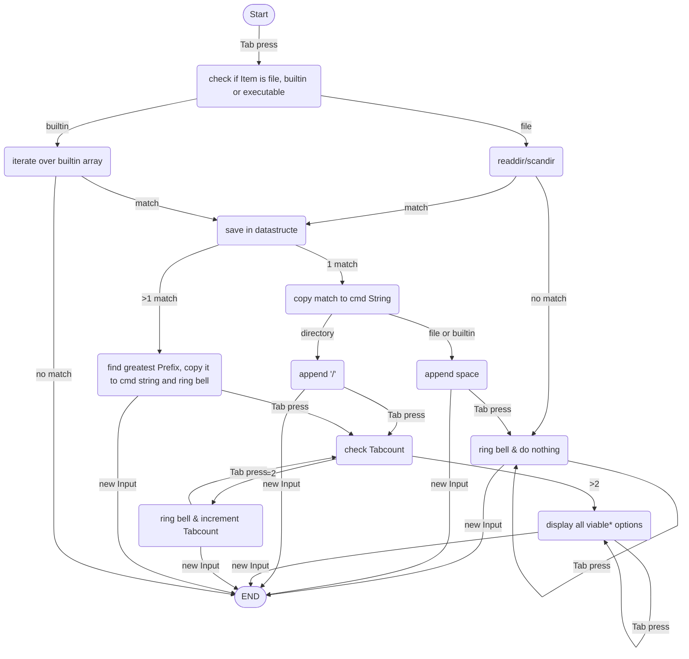

```mermaid
flowchart TD

    A([Start]) -->|Tab press| B(check if Item is file, builtin or executable)
    B --> |file| C(readdir/scandir)
    B -->|builtin| D(iterate over builtin array)
    C --> |match| E(save in datastructe)
    C --> |no match| F(ring bell & do nothing)
    F --> |Tab press| F 
    F --> |new Input| Z([END])
    E --> |1 match| G(copy match to cmd String)
    G --> |file or builtin| H(append space)
    H --> |Tab press| F
    H --> |new Input| Z
    G --> |directory| I(append '/')
    I --> |new Input| Z
    I --> |Tab press| J(check Tabcount)
    J --> |>2| K(display all viable* options)
    K --> |Tab press| K
    K --> |new Input| Z
    J --> |<=2| L(ring bell & increment Tabcount)
    L --> |Tab press| J
    L --> |new Input| Z
    E --> |>1 match| M(find greatest Prefix, copy it to cmd string and ring bell)
    M --> |new Input| Z
    M --> |Tab press| J
    D --> |match| E 
    D --> |no match| Z
```